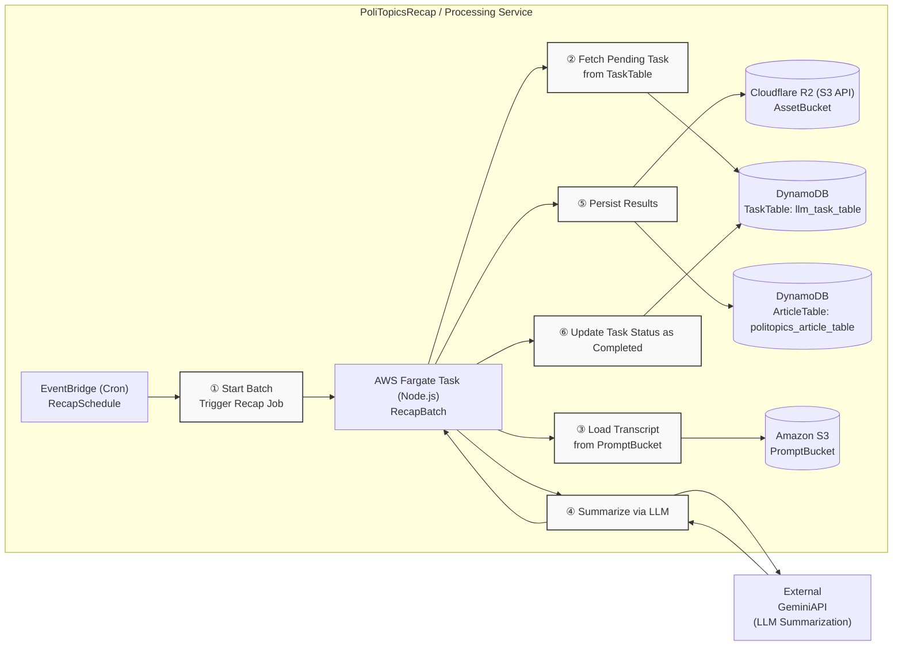

# PoliTopics Recap
[日本語版](./jp/README.md)

Summarization and article persistence: consume tasks from DynamoDB, pull prompts from S3, generate recaps, store article assets in R2, and metadata in DynamoDB. Runs on AWS Fargate (scheduled by EventBridge) with Discord notifications.

## Architecture



Highlights
- Prompts/results are read from S3; article assets (`asset.json`) are written to R2 with public/signed URLs.
- DynamoDB stores metadata and thin indexes for headlines/suggestions.
- Discord webhooks: error/warn/batch.

## Commands (pnpm)
- Install: `pnpm install`
- Ensure LocalStack resources: `pnpm run ensure:localstack`
- Test (LocalStack): `pnpm test` (`APP_ENVIRONMENT=localstackTest`, `pretest` applies resources)
- Test (gha): `pnpm run test:gha`
- Build: `pnpm build`
- Local invoke helper: `pnpm dev`

## Environment
- `APP_ENVIRONMENT` (`local`|`stage`|`prod`|`ghaTest`|`localstackTest`)
- `GEMINI_API_KEY`
- `TASK_TABLE_NAME`, `TASK_STATUS_INDEX_NAME`
- `PROMPT_BUCKET_NAME` (S3)
- `ARTICLE_TABLE_NAME`, `ARTICLE_ASSET_BUCKET_NAME` (R2 bucket name)
- R2 access: `R2_WRITE_ENDPOINT_URL`, `R2_ACCESS_KEY_ID`, `R2_SECRET_ACCESS_KEY`, `R2_ARTICLE_BUCKET`, `R2_PUBLIC_ASSET_URL`
- Notifications: `DISCORD_WEBHOOK_ERROR`, `DISCORD_WEBHOOK_WARN`, `DISCORD_WEBHOOK_BATCH`
- AWS: `AWS_REGION` (default `ap-northeast-3`), `AWS_ENDPOINT_URL` for LocalStack

Tip: from repo root, `source ../scripts/export_test_env.sh` to populate LocalStack defaults before running tests.

## Local flow
1) Start LocalStack (root `docker-compose.yml`).
2) `pnpm run ensure:localstack`
3) `pnpm test` or `pnpm dev` for local invocation.

## Terraform
- LocalStack guide: `docs/terraform-localstack.md`
- Typical flow:
```bash
cd terraform
terraform init -backend-config=backends/local.hcl
terraform plan -var-file=tfvars/localstack.tfvars -out=tfplan
terraform apply tfplan
```

## Observability
- Discord notifications for errors/warns/batch.
- CloudWatch logs for the Fargate task (or LocalStack logs locally).
