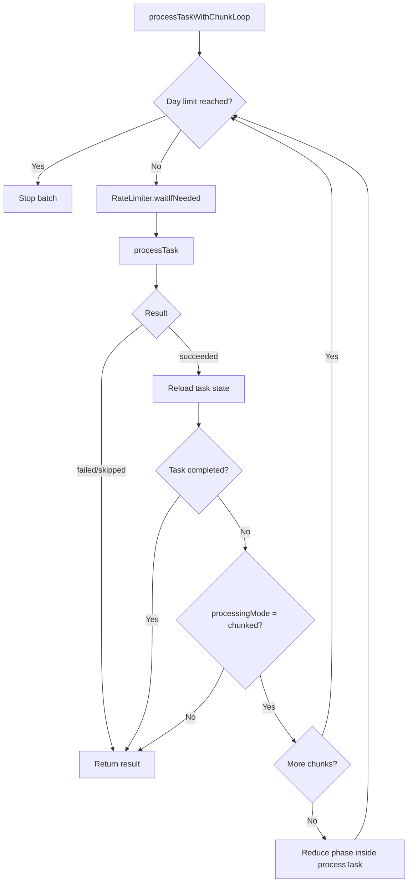

# PoliTopicsRecap Fargate Architecture

## Overview

PoliTopicsRecap runs as an ECS Fargate task that is triggered once daily by EventBridge Scheduler. The container processes pending LLM tasks with configurable rate limiting and exits when complete. Lambda-based execution has been removed.

## Architecture Diagram

```
EventBridge Scheduler (1日1回 / Once daily)
         │
         ▼
   ECS Fargate Task (起動 / Start)
         │
         ▼
   ┌─────────────────────────────────────┐
   │  Recap Container                    │
   │  ├── Rate Limiter (configurable)    │
   │  ├── Task Loop                      │
   │  │   ├── Fetch pending tasks        │
   │  │   ├── Process with rate limit    │
   │  │   └── Repeat until done/limit    │
   │  └── Exit with code 0/1             │
   └─────────────────────────────────────┘
         │
         ▼
   Container終了 → Fargate Task終了
```

## Processing Flow

```mermaid
flowchart TD
  A[Start] --> B[Count ready tasks]
  B --> C[Set maxTasks = max(RPD, ready)]
  C --> D{Requeue completed w/ major prompt mismatch?}
  D -->|Yes| E[Requeue up to cap]
  D -->|No| F
  E --> F[Loop while processed < maxTasks]

  F --> G{Fetch next task}
  G -->|None| H[Exit 0]
  G -->|Found| I[processTaskWithChunkLoop]

  I --> J{Day limit reached?}
  J -->|Yes| H
  J -->|No| K[RateLimiter.waitIfNeeded]
  K --> L[processTask]

  L --> M{Result}
  M -->|succeeded| N[Stats: succeeded]
  M -->|failed| O[Stats: failed + cooldown]
  M -->|skipped| P[Stats: skipped]

  N --> Q[Stats: processed++]
  O --> Q
  P --> Q
  Q --> F
```

## Chunked Task Subflow



## Configuration

### Rate Limit Settings (config.ts)

```typescript
rateLimit: {
  requestsPerMinute: number; // RPM制限 (default: 15)
  requestsPerDay: number; // 日次リクエスト上限 (default: 1500)
  maxConsecutiveErrors: number; // 連続エラー閾値 (default: 5)
  cooldownOnErrorMs: number; // エラー時の待機時間 (default: 30000)
}

batch: {
  maxTasksPerRun: number | "auto"; // 'auto' = max(requestsPerDay, pending tasks)
  gracefulShutdownTimeoutMs: number; // シャットダウン待機時間 (default: 10000)
}
```

### Environment Variables

| Variable                | Description                                             | Required          |
| ----------------------- | ------------------------------------------------------- | ----------------- |
| `APP_ENVIRONMENT`       | Environment (prod/stage/local)                          | Yes               |
| `GEMINI_API_KEY`        | Gemini API key                                          | Yes (prod/stage)  |
| `GEMINI_MAX_INPUT_TOKEN`  | Gemini max input tokens (default: 64000 in prod/stage) | No               |
| `GEMINI_MAX_OUTPUT_TOKEN` | Gemini max output tokens (default: 64000)               | No               |
| `DISCORD_WEBHOOK_ERROR` | Error notification webhook                              | Yes               |
| `DISCORD_WEBHOOK_WARN`  | Warning notification webhook                            | Yes               |
| `DISCORD_WEBHOOK_BATCH` | Batch notification webhook                              | Yes               |
| `R2_WRITE_ENDPOINT_URL` | Cloudflare R2 endpoint URL                              | Yes (prod/stage)  |
| `R2_ACCESS_KEY_ID`      | R2 access key ID                                        | Yes (prod/stage)  |
| `R2_SECRET_ACCESS_KEY`  | R2 secret access key                                    | Yes (prod/stage)  |
| `R2_ARTICLE_BUCKET`     | R2 bucket for article assets                            | No (uses default) |
| `R2_REGION`             | R2 region (default: "auto")                             | No                |
| `R2_PUBLIC_ASSET_URL`   | R2 public URL (default: "https://asset.politopics.net") | No                |

## Storage Architecture

### Cloudflare R2 Integration

Article assets (summaries, dialogs) are stored in Cloudflare R2 instead of AWS S3 for cost savings and edge performance.

#### Public Access via Custom Domain

Assets are served publicly via `asset.politopics.net`:

```
Frontend (politopics.net)
       │
       ├── API Request ────► api.politopics.net ────► DynamoDB (metadata only)
       │                          │
       │                          ▼
       │                     { article, assetUrl }
       │
       └── Asset Request ──► asset.politopics.net ──► R2 (CDN cached)
                                   │
                                   ▼
                              { summary, dialogs, ... }
```

#### Data Flow

1. **API Response**: Backend returns article metadata with `assetUrl`
2. **Asset Fetch**: Frontend fetches asset directly from R2 via public URL
3. **Merge**: Frontend merges metadata + asset for display

This architecture provides:

- **Faster API responses**: No S3/R2 reads in backend
- **CDN caching**: Assets cached at Cloudflare edge
- **Zero egress cost**: R2 has no egress fees

### R2 Configuration

R2 uses S3-compatible API. The configuration is set per environment:

| Environment | R2 Enabled | Bucket                    | Public URL                   |
| ----------- | ---------- | ------------------------- | ---------------------------- |
| local       | No         | LocalStack S3             | N/A                          |
| stage       | Yes        | politopics-articles-stage | https://asset.politopics.net |
| prod        | Yes        | politopics-articles-prod  | https://asset.politopics.net |

### Cloudflare Dashboard Setup (Required)

To enable public access via custom domain:

1. **R2 Bucket Settings** → Connect Custom Domain → `asset.politopics.net`
2. **CORS Configuration**:
   ```json
   [
     {
       "AllowedOrigins": ["https://politopics.net", "https://*.politopics.net"],
       "AllowedMethods": ["GET", "HEAD"],
       "AllowedHeaders": ["*"],
       "MaxAgeSeconds": 86400
     }
   ]
   ```
3. **Cache Rules**: Set `Cache-Control: public, max-age=31536000, immutable` for `/articles/*`

## Exit Codes

| Code | Meaning                          | Action             |
| ---- | -------------------------------- | ------------------ |
| 0    | All tasks completed successfully | Normal termination |
| 1    | Max consecutive errors reached   | Error termination  |

## AWS Resources

### ECS Fargate

- **Cluster**: `politopics-recap-{env}`
- **Task Definition**: `politopics-recap-task-{env}`
- **CPU**: 256 (0.25 vCPU)
- **Memory**: 512 MB

### ECR

- **Repository**: `politopics-recap`
- **Image Tag**: `{env}-{git-sha}`

### EventBridge Scheduler

- **Schedule**: `cron(0 9 * * ? *)` (9:00 AM JST daily)
- **Target**: ECS Fargate Task

### IAM Roles

- **Task Execution Role**: Pull ECR images, CloudWatch logs
- **Task Role**: DynamoDB, S3, SQS access

## Local Testing

### With Docker Compose (LocalStack)

```bash
# Start LocalStack and app
docker-compose up -d

# Run container in batch mode
docker-compose run --rm app-batch
```

### Manual Container Run

```bash
# Build image
docker build -t politopics-recap:local .

# Run with LocalStack
docker run --rm \
  --network politopics-network \
  -e APP_ENVIRONMENT=local \
  -e AWS_ENDPOINT=http://localstack:4566 \
  politopics-recap:local
```
