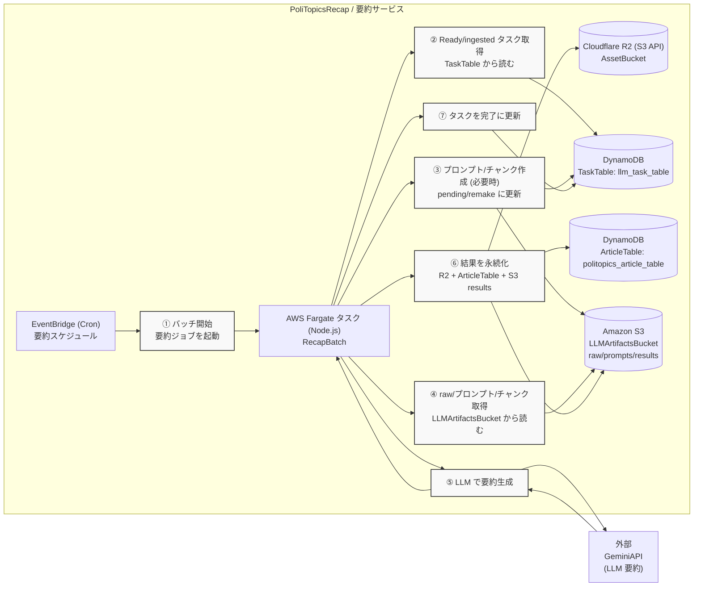

# PoliTopics Recap
[English Version](../README.md)

タスクを DynamoDB から取得し、S3 のプロンプトを読み込み、LLM で要約して R2 に記事アセットを保存、メタデータを DynamoDB に書き込む処理サービスです。EventBridge スケジュールで AWS Fargate を起動し、Discord に通知を送ります。

## アーキテクチャ



ポイント
- プロンプト/結果は S3、記事アセット (`asset.json`) は R2 に保存し、公開/署名付き URL を返す。
- メタデータと薄いインデックスは DynamoDB に保存し、ヘッドラインやサジェストを 1 クエリで取得。
- Discord Webhook を error/warn/batch に利用。

## コマンド (pnpm)
- インストール: `pnpm install`
- LocalStack リソース確認/作成: `pnpm run ensure:localstack`
- テスト (LocalStack): `pnpm test` (`APP_ENVIRONMENT=localstackTest`, `pretest` でリソース適用)
- テスト (gha): `pnpm run test:gha`
- ビルド: `pnpm build`
- ローカル呼び出し: `pnpm dev`

## 環境変数
- `APP_ENVIRONMENT` (`local`|`stage`|`prod`|`ghaTest`|`localstackTest`)
- `GEMINI_API_KEY`
- `GEMINI_MAX_INPUT_TOKEN`, `GEMINI_MAX_OUTPUT_TOKEN`
- `CHUNK_PACKING_TOKEN_BUDGET_RATIO` (デフォルト `0.85`)
- `SINGLE_CHUNK_MAX_SPEECHES` (デフォルト `40`)
- `SINGLE_CHUNK_MAX_TOKEN_USAGE_RATIO` (デフォルト `0.5`)
- `TASK_TABLE_NAME`, `TASK_STATUS_INDEX_NAME`
- `PROMPT_BUCKET_NAME` (S3)
- `ARTICLE_TABLE_NAME`, `ARTICLE_ASSET_BUCKET_NAME` (R2 バケット名)
- R2: `R2_WRITE_ENDPOINT_URL`, `R2_ACCESS_KEY_ID`, `R2_SECRET_ACCESS_KEY`, `R2_ARTICLE_BUCKET`, `R2_PUBLIC_ASSET_URL`
- 通知: `DISCORD_WEBHOOK_ERROR`, `DISCORD_WEBHOOK_WARN`, `DISCORD_WEBHOOK_BATCH`
- AWS: `AWS_REGION` (デフォルト `ap-northeast-3`), LocalStack 用 `AWS_ENDPOINT_URL`

チャンク化メモ:
- `single_chunk` は小規模会議（発言数/トークン比率しきい値）に限定して使用。
- `chunked` では各 chunk に `based_on_orders` を保持し、reduce 入力へ範囲情報を渡す。

ヒント: リポジトリルートで `source ../scripts/export_test_env.sh` を実行すると、LocalStack 用の主要デフォルトが一括で設定されます。

## ローカルフロー
1) LocalStack を起動 (リポジトリルートの `docker-compose.yml`)。
2) `pnpm run ensure:localstack`
3) `pnpm test` または `pnpm dev` を実行。

## Terraform
- LocalStack 手順: `docs/jp/terraform-localstack.md`
- 典型フロー:
```bash
cd terraform
terraform init -backend-config=backends/local.hcl
terraform plan -var-file=tfvars/localstack.tfvars -out=tfplan
terraform apply tfplan
```

## オブザーバビリティ
- Discord で error/warn/batch を通知。
- CloudWatch (Fargate) または LocalStack のログを確認。
